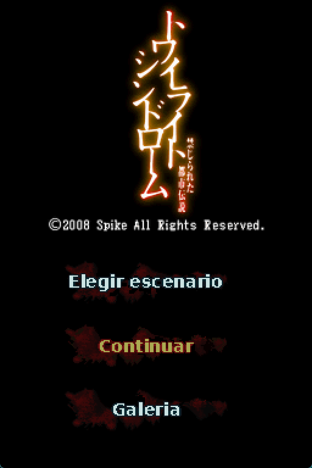
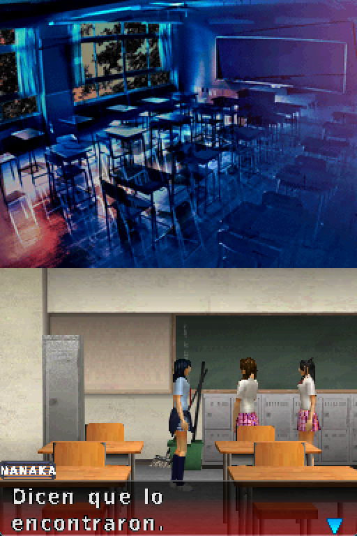
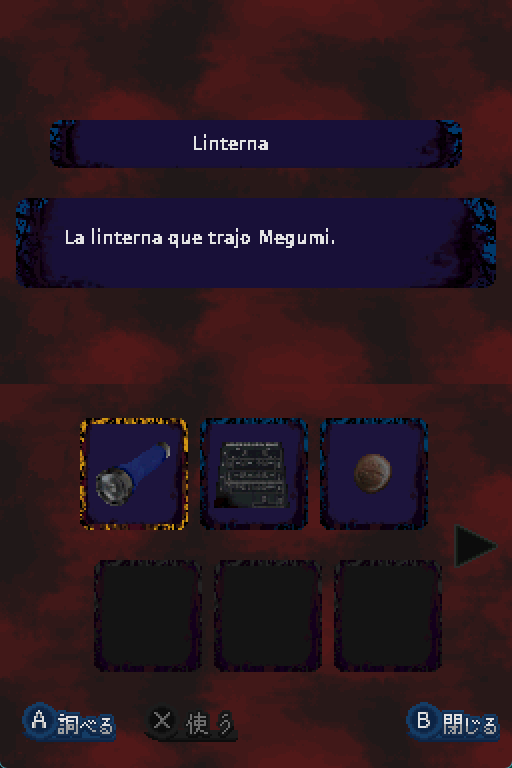
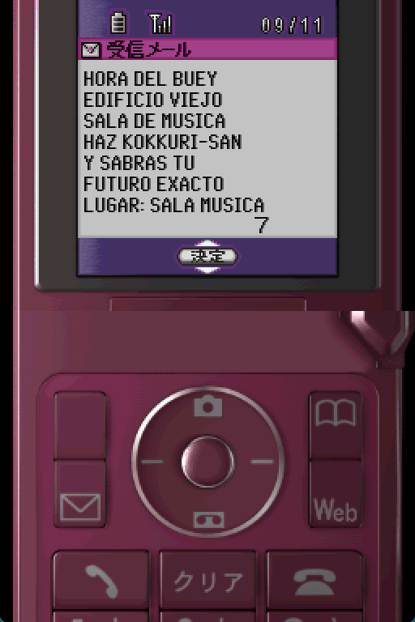
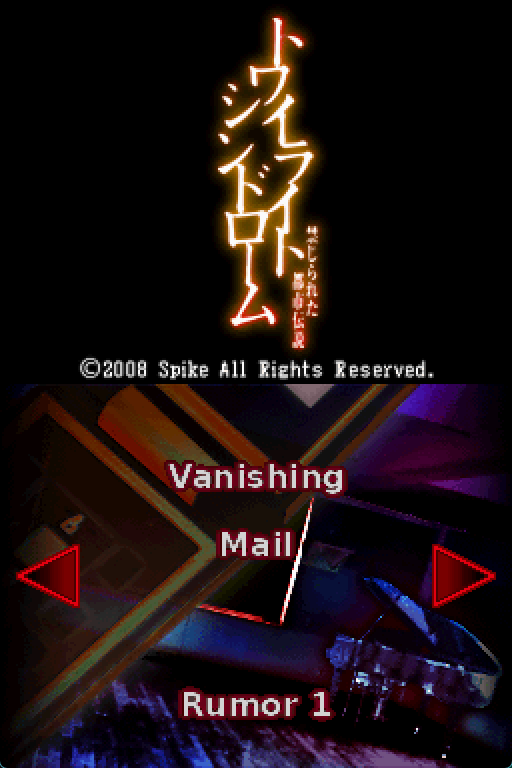
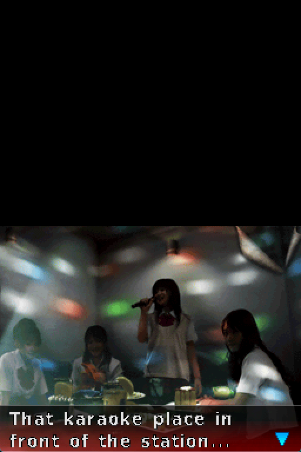
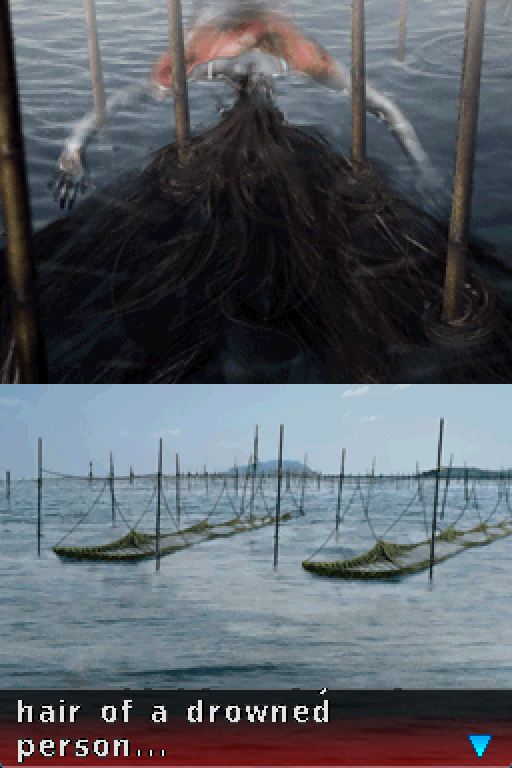
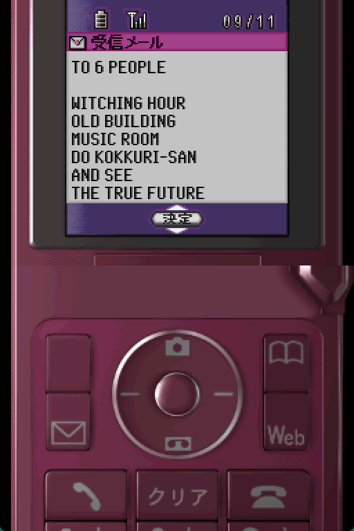

# Twilight Syndrome: Kinjirareta Toshi Densetsu (DS) — Spanish and English Fan Translation

Fan translation of **Twilight Syndrome: Kinjirareta Toshi Densetsu**
(トワイライトシンドローム 禁じられた都市伝説, XAX Entertainment / Spike, 2008)
for the Nintendo DS into **Spanish** and **English**. It is an urban-legend
horror mystery game where high school girls chase the rumors spreading around
their town (Kokkuri-san, Hitori Kakurenbo, chain mails from a sender called
Nanashi, and several legends original to this game). As far as we know, it had
no previous English or Spanish translation.

**Spanish**

<p>




</p>

**English**

<p>




</p>

> **Version 1.1**
> This repository does **not** contain the game. You need your own copy of the original Japanese ROM.

## What is translated

- **Full script** (over 6,600 lines of dialogue, menus and system messages),
  reinserted with a pointer-relocation scheme: the engine stores the whole
  script inside the ARM9 binary with hardcoded pointers, so longer translated
  lines are moved to free space instead of being squeezed in place.
- **Custom Latin font**: the original font only has kanji/kana and a handful of
  Latin letters. A full A-Z/a-z alphabet with Ñ, accented vowels, ¿ ¡ and
  punctuation was designed from scratch in the game's pixel style.
- **Character name tags** and the **38 inventory item screens**, whose text is
  drawn directly into the graphics (NCGR/NCER) and was redrawn per language.
- **Menus with text baked into the graphics**: title screen, story/ending
  selection menu (45 cards across 6 story arcs), save/load menu and the rumor
  cards shown when loading each story.
- **Phone mails** *(new in 1.1)*: the chain mails received on the in-game cell
  phone (around 24 different mails, including the "problem" riddles) are
  sprites, not script text. They were redrawn with a new phone font that
  imitates the original LCD style.

## Playing the translation (patch users)

1. Get the original ROM and check it matches:

   | File | Size | CRC32 | SHA-1 |
   |---|---|---|---|
   | `Twilight Syndrome - Kinjirareta Toshi Densetsu (Japan).nds` | 134,217,728 bytes | `76F1DB67` | `129880d90ecc1b322255e56d4968b259a3e1aa15` |

2. Download the `.bps` patch for your language from the [Releases](../../releases)
   page: `Twilight.Syndrome.ESP.v1.1.bps` (Spanish) or
   `Twilight.Syndrome.ENG.v1.1.bps` (English).
3. Apply it to the original ROM with any BPS patcher (for example
   [Flips](https://github.com/Alcaro/Flips) or
   [Rom Patcher JS](https://www.marcrobledo.com/RomPatcher.js/)).
   Flips may warn that the original ROM is larger than the result: that is
   expected, because the original dump contains padding that the patched ROM
   does not keep.
4. Expected result:

   | Patch | Result | Size | CRC32 | SHA-1 |
   |---|---|---|---|---|
   | `Twilight.Syndrome.ESP.v1.1.bps` | Spanish | 116,146,888 bytes | `3B2D8397` | `c7bc19f5e89028fa6f91cc161e206b4ecf7bf42c` |
   | `Twilight.Syndrome.ENG.v1.1.bps` | English | 116,155,080 bytes | `55F7125B` | `79e12ec1abb306b16d3bcf59817fbe1cd46bc519` |

Tested in [melonDS](https://melonds.kuribo64.net/) and on a real New 3DS.

**Updating from 1.0:** your in-game save (`.sav`) keeps working, but do **not**
load emulator savestates made with the 1.0 ROM: a savestate stores the graphics
that were already loaded in memory, so old text can reappear.

## Building the ROMs from source

This is only needed if you want to regenerate the ROMs yourself or modify the
translation. If you just want to play, use the patches above.

1. **Get this repository** (`git clone https://github.com/Secabel/twilight-syndrome.git`,
   or "Download ZIP" on GitHub and extract it). It already includes the
   translation CSVs, the font and all the redrawn graphics.
2. **Install the tools:** [Python 3](https://www.python.org/downloads/) and the
   packages `ndspy` and `Pillow`:

   ```
   pip install ndspy pillow
   ```

3. **Copy your original ROM** into the repository folder, named exactly
   `Twilight Syndrome - Kinjirareta Toshi Densetsu (Japan).nds` (see the
   checksums above).
4. **Run, from that folder:**

   ```
   python generar_rom_esp.py     # Spanish -> Twilight Syndrome - ESP.nds
   python generar_rom_eng.py     # English -> Twilight Syndrome - ENG.nds
   ```

The results should match the checksums listed above.

To edit a phone mail, change its text in `assets/csv/correos_celular.csv`,
run `python scripts/redibujar_correos.py` (it rebuilds
`assets/graficos/{esp,eng}/R08/` from the original ROM) and then the two
generators again.

## Repository contents

| File / folder | What it is |
|---|---|
| `generar_rom_esp.py`, `generar_rom_eng.py` | Build the Spanish / English ROM from the original ROM and `assets/` |
| `assets/csv/guion_principal_esp.csv`, `assets/csv/guion_principal_eng.csv` | Main script: one row per line, with the ROM offset, the original Japanese text and the translation |
| `assets/csv/correos_celular.csv` | Phone mails: one row per sprite line (Japanese, Spanish, English) |
| `assets/font/TWSFont_v22.NFTR` | Game font with the added Latin glyphs |
| `assets/graficos/esp/`, `assets/graficos/eng/` | Redrawn graphics per language (same folder structure as the ROM); the generators apply everything they find there |
| `assets/graficos/*.NCGR`, `assets/graficos/I22S10.NCER` | Graphics shared by both languages (character name tags, extended item cell) |
| `scripts/extraer_texto.py` | Extracts the script from the ARM9 binary to CSV |
| `scripts/extraer_todos_items.py` | Extracts the inventory item texts |
| `scripts/ncer_decode.py` | Decoder for DS tile graphics (NCGR/NCLR/NCER/NSCR) |
| `scripts/fuente_celular.py`, `scripts/redibujar_correos.py` | Phone font and the script that redraws the phone mails |
| `images/` | Screenshots used in this README |
| `Twilight Syndrome ESP.bps`, `Twilight Syndrome ENG.bps` | Version 1.0 patches, kept for existing links (current patches are on the Releases page) |

The Japanese script is included in the main CSVs (`texto_original` column),
so the files can also be used as a starting point for a translation into
another language.

## Known issues

- **Some phone screens are still in Japanese:** sending a mail
  (送信中 / 送信しました), call history, audio playback, the call screen,
  the "page not found" web screen and the 決定 (OK) button on the phone
  wallpapers. They are short and do not affect understanding the story.
- **Mail photos inside some cutscenes** (blurry or tilted shots of the phone)
  keep their Japanese text; the same mails can be read translated on the phone.
- **Left untranslated on purpose:** the "touch the bottom screen" prompt on
  the title screen, and a few props with text drawn into the background art
  (a puzzle sheet with a kana table, whose solution depends on the original
  characters, and a manual page that is not legible even in the original).
- With many routes and endings, not every route has been re-tested after
  every change. Some typos or inconsistencies may remain; reports are welcome
  in [Issues](../../issues).

## Version history

### 1.1
- Translated the phone mails: all 12 mailbox sets (around 24 different mails,
  including the chain mails from Nanashi and the "problem" riddles), redrawn
  with a new font that imitates the phone's LCD style.
- Added the tools used for it (`scripts/fuente_celular.py`,
  `scripts/redibujar_correos.py`) and the mail text (`assets/csv/correos_celular.csv`).

### 1.0
- Initial public release: full script, custom font, name tags, inventory,
  menus and rumor cards in Spanish and English.

## Credits

- Translation and ROM hacking: **Talion**.
- Inventory and name-tag text drawn with DejaVu Sans Condensed
  ([DejaVu fonts license](https://dejavu-fonts.github.io/License.html)).
- Tools: [melonDS](https://melonds.kuribo64.net/), [ndspy](https://github.com/RoadrunnerWMC/ndspy),
  [Flips](https://github.com/Alcaro/Flips), Python and Pillow.

## License

The scripts and translation files in this repository are released under the
[MIT License](LICENSE). The license does not cover the game itself (see below).

## Legal

This is an unofficial fan project, not affiliated with or endorsed by the
original developers or publishers. *Twilight Syndrome: Kinjirareta Toshi
Densetsu* and all related rights belong to their respective owners. No game
data is distributed here: the patches only contain the differences from the
original ROM, which you must supply yourself.
